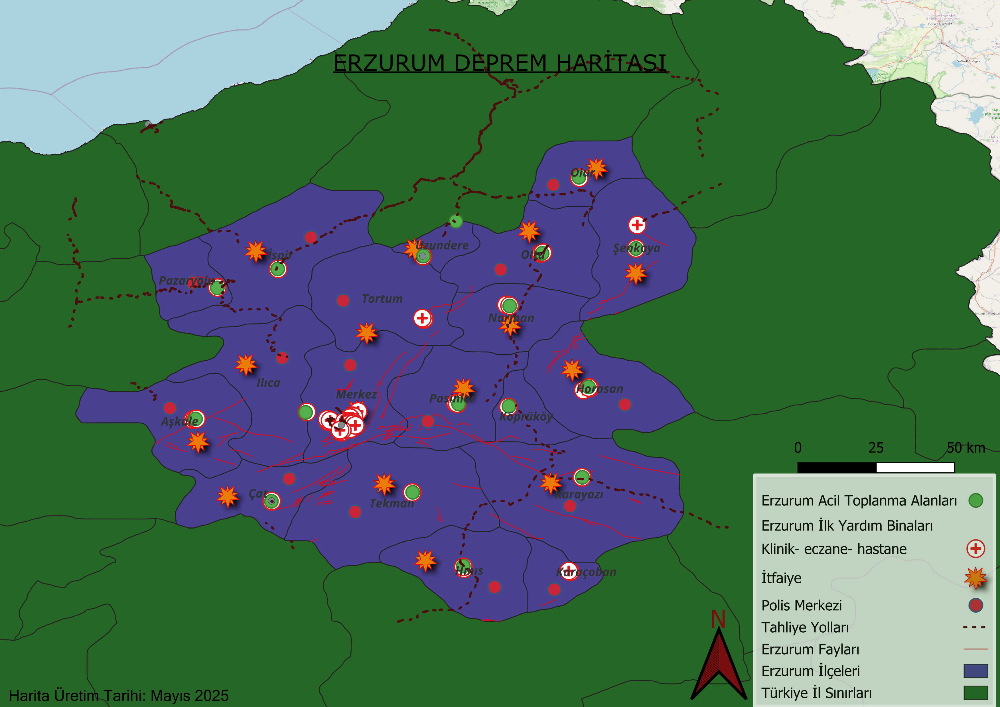

# Erzurum QGIS Projesi 🗺️

Bu proje, Erzurum ilinde olası bir deprem durumunda yönlendirme yapılabilecek **acil toplanma alanları**, **sağlık ve emniyet kurumları**, ve **fay hatları** gibi kritik verilerin haritalandırılmasını amaçlamaktadır. Projede açık veri kaynakları kullanılmış ve QGIS yazılımı aracılığıyla birleştirilmiştir.

---

## 📁 İçerikler
- `.qgz` uzantılı QGIS proje dosyası
- `.shp`, `.shx`, `.dbf`, `.prj` gibi shapefile katmanları
- `.gpkg`, `.json` gibi ek veri dosyaları
- Haritanın son hali `.png` görseli

---

## 🔗 Notion Sunumu
Projeyi görsellerle ve açıklamalarla detaylı incelediğim Notion sayfası:

👉 [Notion Sunumunu Görüntüle](https://www.notion.so/Erzurum-Deprem-Haritas-QG-S-Projesi-1fd46757897d8014ac47e9cde51ef156?pvs=4)

---

## 🖼️ Harita Önizleme
Haritanın son hali:

---

## 👤 Hazırlayan
**Burcu Gezici**  
Bandırma Onyedi Eylül Üniversitesi  
Yazılım Mühendisliği – Mayıs 2025

---
